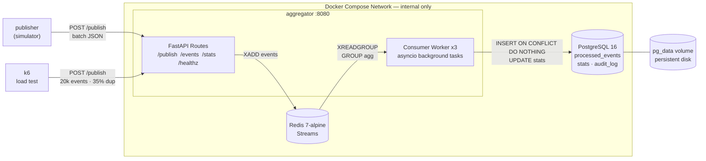
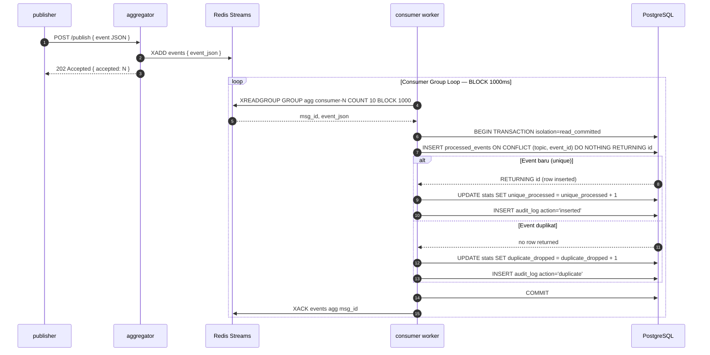
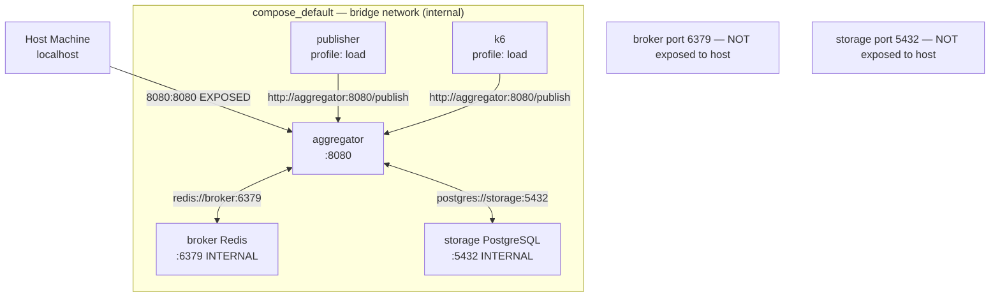
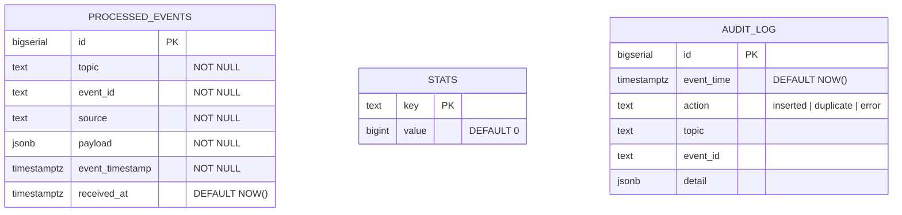

# Pub-Sub Log Aggregator

**Stack**: Python 3.11 · FastAPI · Redis Streams · PostgreSQL 16 · Docker Compose

> Proyek UAS Mata Kuliah Sistem Terdistribusi — Idempotent Consumer + Deduplication + Transaksi.
> Semua service berjalan **100% lokal** di Docker Compose — tidak ada dependensi ke layanan cloud publik.

---

## Dokumen Terkait

| Dokumen | Deskripsi |
|---------|-----------|
| [report.md](report.md) | Laporan UAS (T1–T10, analisis performa, daftar pustaka APA 7th) |

---

## Arsitektur Sistem



### Poin Desain

| Komponen | Keputusan | Alasan |
|---|---|---|
| Broker | Redis Streams | At-least-once native via ACK mechanism |
| Dedup store | PostgreSQL `UNIQUE(topic, event_id)` | Atomic, tahan restart, ACID |
| Multi-worker | Redis consumer group (3 consumer) | Distribusi otomatis, tidak double-process |
| Isolation | `READ COMMITTED` | Cukup dengan UNIQUE constraint, overhead rendah |
| Persistensi | Named volumes `pg_data`, `broker_data` | Survive `docker compose down` tanpa `-v` |

---

## Alur Publish-Consume



---

## Topologi Jaringan



---

## Skema Database



**Constraint kunci:** `UNIQUE (topic, event_id)` pada tabel `processed_events` — fondasi dari seluruh mekanisme deduplication.

---

## Cara Menjalankan

```bash
# 1. Clone repo
git clone https://github.com/[username]/uts-distrib.git
cd uts-distrib

# 2. Jalankan core services
docker compose up -d --build

# 3. Cek health
curl http://localhost:8080/healthz
# {"status":"ok","db":"ok","broker":"ok"}

# 4. Publish event baru
curl -X POST http://localhost:8080/publish \
  -H 'Content-Type: application/json' \
  -d '{"topic":"demo","event_id":"E001","timestamp":"2025-01-15T10:00:00Z","source":"cli","payload":{"v":1}}'

# 5. Kirim duplikat (event_id sama)
curl -X POST http://localhost:8080/publish \
  -H 'Content-Type: application/json' \
  -d '{"topic":"demo","event_id":"E001","timestamp":"2025-01-15T10:00:01Z","source":"cli","payload":{"v":1}}'

# 6. Cek stats (duplicate_dropped harus = 1)
curl http://localhost:8080/stats | python3 -m json.tool

# 7. Lihat events
curl "http://localhost:8080/events?topic=demo&limit=10"

# 8. Load test (20k event, 35% duplikat)
docker compose --profile load run --rm k6

# 9. Publisher simulator (20k event @ 40% duplikat)
docker compose --profile load up publisher
```

## Menjalankan Tests

```bash
# Di host (butuh Postgres + Redis running)
cd aggregator
pip install -r requirements.txt
pytest tests/ -v

# Di dalam container
docker compose run --rm aggregator pytest tests/ -v
```

---

## Endpoints

| Method | Path | Deskripsi | Response |
|--------|------|-----------|----------|
| `POST` | `/publish` | Kirim single atau batch event | `202 {"accepted":N,"duplicated":M}` |
| `GET` | `/events?topic=X&limit=100` | Daftar event unik yang diproses | `200 [{...}]` |
| `GET` | `/stats` | Statistik: received, unique, dup, uptime | `200 {"received":N,...}` |
| `GET` | `/healthz` | Health check DB + broker | `200 {"status":"ok"}` |

### Contoh Response `/stats`

```json
{
  "received":          20000,
  "unique_processed":  13021,
  "duplicate_dropped":  6979,
  "topics":               20,
  "uptime_seconds":     87.4,
  "duplicate_rate":    0.3490
}
```

---

## Bukti Persistensi

```bash
# Catat stats sebelum stop
curl http://localhost:8080/stats

# Stop container — TANPA -v (volume AMAN)
docker compose stop

# Start ulang
docker compose start
sleep 10

# Cek stats sesudah — angka HARUS sama
curl http://localhost:8080/stats
```

Named volumes `pg_data` dan `broker_data` hanya dihapus jika eksplisit `docker compose down -v`. Container recreate biasa tidak menghapus data.

---

## Distribusi Tests

Total **19 tests** dalam 6 file:

| # | File | Cakupan |
|---|------|---------|
| 1–3 | `test_dedup.py` | Insert baru, duplikat return False, hanya 1 row di DB |
| 4–7 | `test_api.py` | POST single, POST batch, GET /events, GET /stats fields |
| 8–10 | `test_concurrency.py` | 50 parallel insert sama, stats no lost-update, no double-process |
| 11–12 | `test_persistence.py` | Data survive reconnect, duplikat tetap ditolak setelah reconnect |
| 13–15 | `test_validation.py` | Missing field 422, invalid timestamp 422, empty batch 400/422 |
| 16–19 | `test_termshot.py` | scripts/ ada, chmod +x, screenshots/ dibuat, PNG magic bytes valid |

---

## Video Demo

> Minimal 25 menit, YouTube unlisted atau public.

Cantumkan di sini setelah upload:

```
Video Demo: https://youtube.com/watch?v=LINK_ANDA
```

Poin yang harus ditampilkan di video:
- Arsitektur multi-service dan alasan desain
- `docker compose up --build` dari nol
- Kirim event duplikat + bukti idempotency di `/stats`
- Demonstrasi transaksi/konkurensi (multi-worker) — output test
- `GET /events` dan `GET /stats` sebelum/sesudah load
- Crash/recreate container + bukti data persisten via volumes
- Keamanan jaringan lokal (broker/storage tidak terekspos ke host)
- Observability: logging, metrik

---

## Asumsi & Catatan

- Broker (Redis 6379) dan Storage (Postgres 5432) **tidak** di-expose ke host.
- Named volumes `pg_data` dan `broker_data` survive `docker compose down` (tanpa `-v`).
- Consumer group Redis: 3 consumer paralel, at-least-once + idempotent dedup.
- Isolation level: `READ COMMITTED` + UNIQUE constraint.

## Referensi

Coulouris, G., Dollimore, J., Kindberg, T., & Blair, G. (2012).
*Distributed systems: Concepts and design* (5th ed.). Addison-Wesley.
