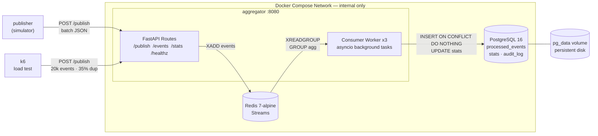
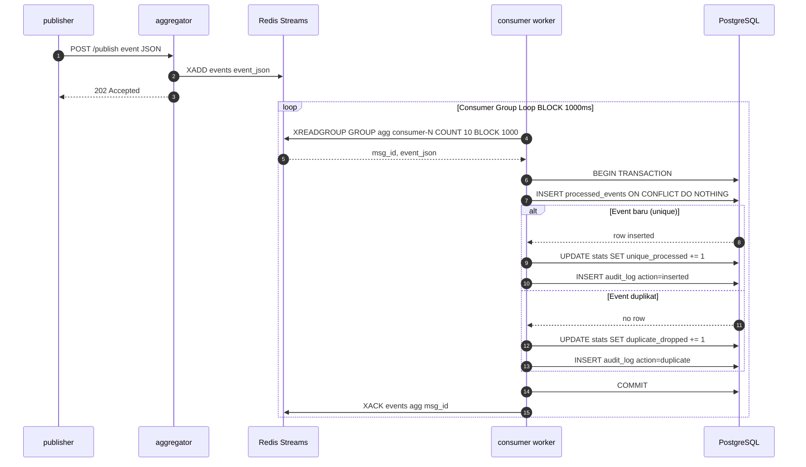
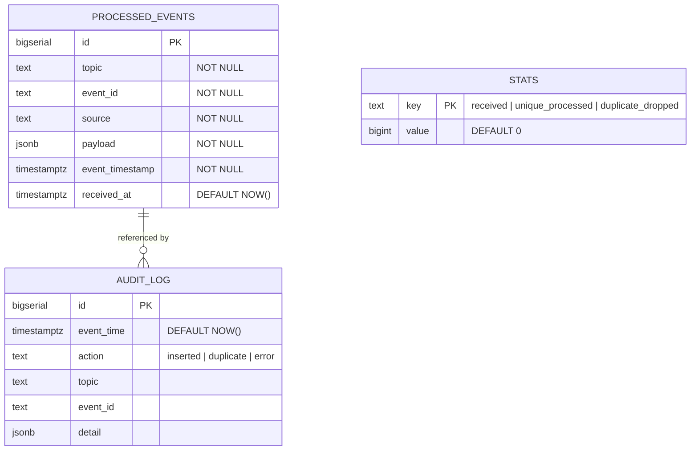
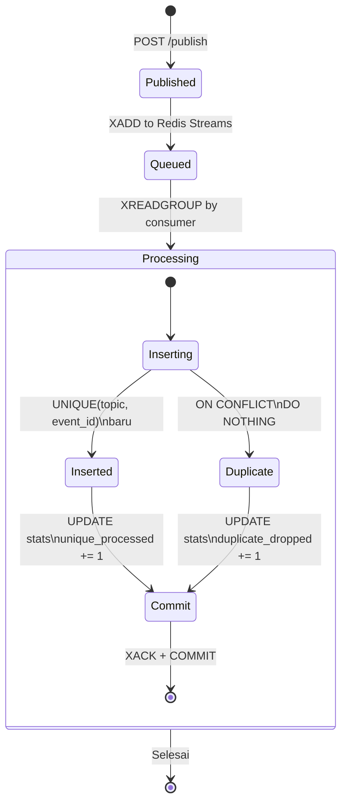

# Pub-Sub Log Aggregator

**Stack**: Python 3.11 · FastAPI · Redis Streams · PostgreSQL 16 · Docker Compose

> Proyek UAS Mata Kuliah Sistem Terdistribusi — Idempotent Consumer + Deduplication + Transaksi.
> Semua service berjalan **100% lokal** di Docker Compose — tidak ada dependensi ke layanan cloud publik.

---

## Dokumen Terkait

| Dokumen | Deskripsi |
|---------|-----------|
| [report.md](report.md) | Laporan UAS (T1–T10, analisis performa, daftar pustaka APA 7th) |

---

## Arsitektur Sistem



### Alur Publish-Consume (Sequence Diagram)



### Entity Relationship Diagram



### Siklus Hidup Event




---


## Cara Menjalankan

```bash
# 1. Clone repo
git clone https://github.com/faedyl/streaming-aggregator.git
cd streaming-aggregator

# 2. Jalankan core services
docker compose up -d --build

# 3. Cek health
curl http://localhost:8080/healthz
# {"status":"ok","db":"ok","broker":"ok"}

# 4. Publish event baru
curl -X POST http://localhost:8080/publish \
  -H 'Content-Type: application/json' \
  -d '{"topic":"demo","event_id":"E001","timestamp":"2025-01-15T10:00:00Z","source":"cli","payload":{"v":1}}'

# 5. Kirim duplikat (event_id sama)
curl -X POST http://localhost:8080/publish \
  -H 'Content-Type: application/json' \
  -d '{"topic":"demo","event_id":"E001","timestamp":"2025-01-15T10:00:01Z","source":"cli","payload":{"v":1}}'

# 6. Cek stats (duplicate_dropped harus = 1)
curl http://localhost:8080/stats | python3 -m json.tool

# 7. Lihat events
curl "http://localhost:8080/events?topic=demo&limit=10"

# 8. Load test (20k event, 35% duplikat)
docker compose --profile load run --rm k6
```

## Menjalankan Tests

```bash
# Di dalam container
docker compose run --rm aggregator pytest tests/ -v
```

---

## Screenshots (Termshot)

| File                        | Isi                                             |
|-----------------------------|-------------------------------------------------|
| `01_compose_services.png`   | `docker compose ps` — semua service running     |
| `02_healthz.png`            | `GET /healthz` — status OK                      |
| `03_publish_single.png`     | Publish event baru                              |
| `04_publish_duplicate.png`  | Duplikat ditolak, stats bertambah               |
| `05_stats_initial.png`      | Stats baseline                                  |
| `06_stats_after_load.png`   | Stats setelah load test                         |
| `07_events_list.png`        | `GET /events` response                          |
| `08_pytest_results.png`     | 19 tests PASSED                                 |
| `10_k6_summary.png`         | k6 load test summary                            |
| `11_persistence_proof.png`  | Bukti data tahan restart                        |
| `12_concurrency_test.png`   | Race condition test output                      |

---

## Endpoints

| Method | Path | Deskripsi | Response |
|--------|------|-----------|----------|
| `POST` | `/publish` | Kirim single atau batch event | `202 {"accepted":N,"duplicated":M}` |
| `GET` | `/events?topic=X&limit=100` | Daftar event unik yang diproses | `200 [{...}]` |
| `GET` | `/stats` | Statistik: received, unique, dup, uptime | `200 {"received":N,...}` |
| `GET` | `/healthz` | Health check DB + broker | `200 {"status":"ok"}` |

---

## Bukti Persistensi

```bash
# Catat stats sebelum stop
curl http://localhost:8080/stats

# Stop container — TANPA -v (volume AMAN)
docker compose stop

# Start ulang
docker compose start
sleep 10

# Cek stats sesudah — angka HARUS sama
curl http://localhost:8080/stats
```

Named volumes `pg_data` dan `broker_data` hanya dihapus jika eksplisit `docker compose down -v`.

---

## Video Demo

🎥 [https://youtu.be/kgmP2x2D0z0](https://youtu.be/kgmP2x2D0z0)

---

## Referensi

Coulouris, G., Dollimore, J., Kindberg, T., & Blair, G. (2012).
*Distributed systems: Concepts and design* (5th ed.). Addison-Wesley.
