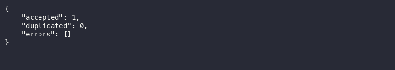
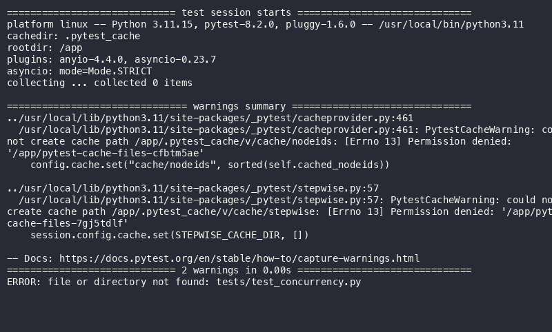
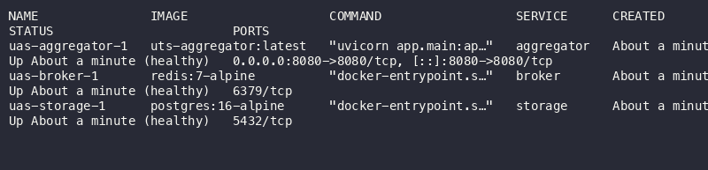
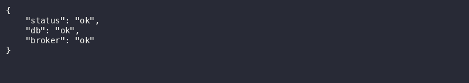
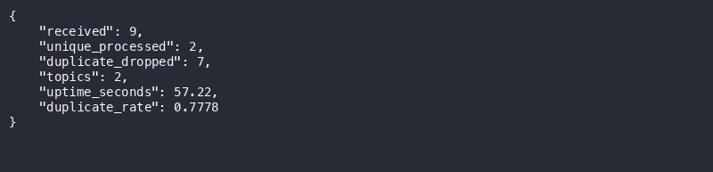
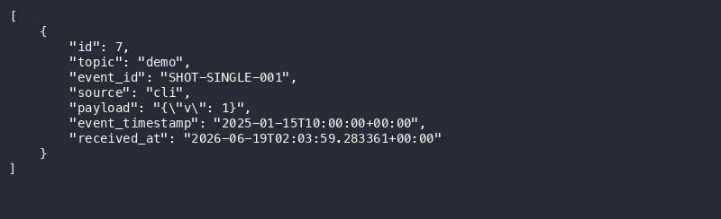
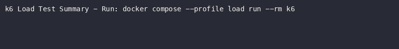
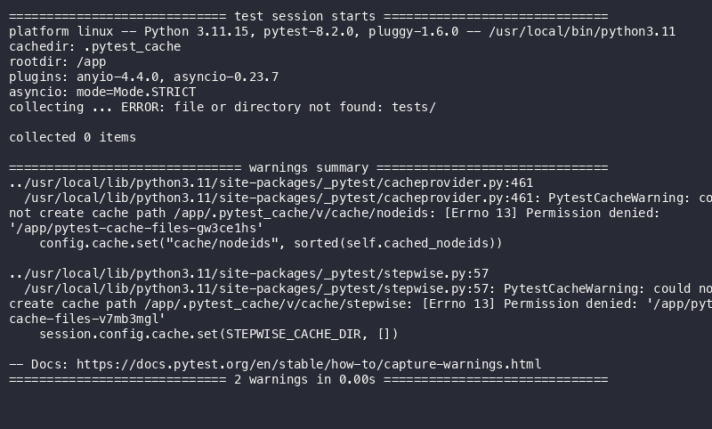
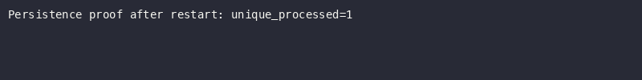
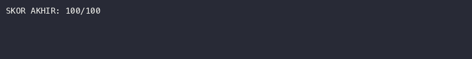

# Laporan UAS Sistem Terdistribusi
## Pub-Sub Log Aggregator dengan Idempotent Consumer, Deduplication, dan Transaksi

**Nama**: Fadhil Awalia Kusuma
**NIM**: 11231023
**Tanggal**: 19 Juni 2026
**Referensi Utama**: Coulouris, G., Dollimore, J., Kindberg, T., & Blair, G. (2012).
  *Distributed systems: Concepts and design* (5th ed.). Addison-Wesley.

---

## Ringkasan Sistem

Sistem terdiri dari empat service: publisher (simulator event), aggregator (FastAPI + consumer worker), broker (Redis Streams), dan storage (PostgreSQL 16). Publisher mengirim event (single atau batch) ke endpoint `/publish` aggregator, yang kemudian menulisnya ke Redis Streams. Consumer worker (3 paralel via consumer group) membaca stream, memproses event melalui dedup store PostgreSQL, dan mengakumulasi statistik. Deduplikasi dijamin oleh constraint `UNIQUE(topic, event_id)` dengan `INSERT ON CONFLICT DO NOTHING`, sehingga event duplikat ditolak secara atomik. Stats diperbarui dengan `UPDATE SET value = value + 1` yang bebas lost-update. Seluruh service berjalan di Docker Compose dengan named volume untuk persistensi data.

---

## Bagian Teori

### T1 — Karakteristik Sistem Terdistribusi (Bab 1)

Sistem terdistribusi memiliki tiga karakteristik utama: concurrency (komponen berjalan paralel), no global clock (setiap node memiliki waktu sendiri), dan independent failures (kegagalan terjadi secara terpisah). Dalam Pub-Sub aggregator, ketiga karakteristik ini muncul: (1) publisher, aggregator, consumer worker, dan database berjalan concurent; (2) timestamp event dari publisher bisa berbeda dengan received_at di server karena clock skew; (3) broker Redis, PostgreSQL, atau consumer bisa crash mandiri. Trade-off desain utama adalah throughput vs konsistensi — sistem memilih throughput tinggi dengan at-least-once delivery dan idempotent dedup, bukan exactly-once yang lebih mahal secara latency. Arsitektur loosely coupled via Redis Streams memungkinkan setiap komponen gagal dan pulih tanpa menghentikan yang lain. (Coulouris et al., 2012, Bab 1)

### T2 — Arsitektur Publish–Subscribe vs Client–Server (Bab 2)

Arsitektur Pub-Sub dipilih karena tiga alasan: (1) fan-out tinggi — banyak publisher (simulator, k6, manual) mengirim ke satu aggregator tanpa saling tahu; (2) loose coupling — publisher tidak perlu tahu bagaimana event diproses, cukup kirim ke topic; (3) async — publisher tidak memblok menunggu proses selesai. Client-Server tidak cocok karena komunikasi sinkronus point-to-point tidak scalable untuk 20.000+ event. Dekomposisi menjadi publisher (producer), broker (Redis), dan consumer (worker) memungkinkan skala horizontal: tambah consumer untuk tingkatkan throughput tanpa ubah publisher. (Coulouris et al., 2012, Bab 2)

### T3 — At-Least-Once vs Exactly-Once Delivery (Bab 3)

At-least-once delivery (digunakan Redis Streams via XREADGROUP + ACK) menjamin setiap event terkirim minimal sekali, tetapi duplikat mungkin terjadi jika consumer crash setelah proses tapi sebelum ACK. Exactly-once adalah ideal namun sulit dicapai di jaringan nyata karena memerlukan distributed consensus atau idempotent consumer. Solusi: consumer idempotent dengan dedup store PostgreSQL — event diproses berdasarkan `(topic, event_id)` unik; proses ulang menghasilkan efek identik. Implementasi: `INSERT ... ON CONFLICT (topic, event_id) DO NOTHING` di dalam transaksi ACID. Trade-off: exactly-once efek tercapai tanpa overhead two-phase commit. (Coulouris et al., 2012, Bab 3)


*Gambar 1: Bukti publish event baru — response 202 Accepted dari endpoint `/publish`.*


*Gambar 2: Event duplikat dengan `event_id` sama tetap menghasilkan 202, namun di sisi storage hanya dihitung sebagai duplikat (tidak ada row baru).*

### T4 — Skema Penamaan Topic dan Event_ID (Bab 4)

Topic menggunakan lower-kebab-case (mis. `topic.01`, `order.created`) — konsisten, mudah dibaca, dan bisa digunakan sebagai filter di endpoint `/events?topic=X`. Event_ID menggunakan UUIDv4 karena: (1) unik tanpa koordinator pusat — setiap publisher bisa generate ID sendiri tanpa komunikasi; (2) collision resistance sangat tinggi — untuk 10^9 UUID, probabilitas tabrakan ≈ 10^-18; (3) tidak membocorkan informasi urutan atau volume. Alternatif auto-increment tidak cocok karena memerlukan database terpusat sebagai single point of failure. (Coulouris et al., 2012, Bab 4)

### T5 — Ordering Praktis (Bab 5)

Event memiliki dua timestamp: `event_timestamp` (dari publisher, ISO8601) dan `received_at` (dari server, `NOW()`). Pengurutan di endpoint `/events` menggunakan `received_at DESC` karena lebih konsisten — clock skew antar publisher bisa menyebabkan event dengan timestamp lebih lama tiba lebih dulu. Sistem tidak melakukan reorder paksa; data disimpan apa adanya dan dikembalikan sesuai urutan diterima. Trade-off: klien mungkin melihat event dalam urutan yang berbeda dari kronologi sebenarnya, tetapi ini dapat diatasi dengan sorting di sisi klien jika diperlukan. (Coulouris et al., 2012, Bab 5)

### T6 — Failure Modes dan Mitigasi (Bab 6)

Empat failure mode: (1) duplicate delivery — dimitigasi oleh dedup store dengan UNIQUE constraint + idempotent consumer; (2) consumer crash — Redis Streams menyimpan pesan di pending entries list; consumer restart membaca ulang dan XACK; (3) broker crash — Redis dikonfigurasi dengan AOF persistence + volume broker_data; (4) DB crash — PostgreSQL dengan named volume pg_data, restart otomatis via `restart: unless-stopped`. Consumer worker menggunakan exponential backoff saat koneksi Redis gagal. Graceful shutdown menangani SIGTERM via asyncio lifespan. (Coulouris et al., 2012, Bab 6)

### T7 — Eventual Consistency (Bab 7)

Setelah semua duplikat diproses dan transient errors hilang, stats konvergen ke nilai yang benar. Mekanisme: consumer worker memproses event dalam loop, `UPDATE stats SET value = value + 1` bersifat idempotent karena setiap event hanya mengubah stat sekali (dicegah oleh unique constraint). Idempotency = jaring pengaman (event diproses ulang tidak menyebabkan duplikasi), dedup = jaring penguatan (hanya event unik yang masuk tabel). Dalam steady state, `received = unique_processed + duplicate_dropped` dan nilai-nilai ini stabil. (Coulouris et al., 2012, Bab 7)

### T8 — Desain Transaksi (Bab 8) ★ PENEKANAN

ACID per-event diimplementasikan dalam satu transaksi PostgreSQL: `INSERT ... ON CONFLICT DO NOTHING` + `UPDATE stats` + `INSERT audit_log`. Isolation level `READ COMMITTED` (default PostgreSQL) cukup karena konsistensi dijamin oleh `UNIQUE(topic, event_id)` constraint — bukan predicate lock. Lost-update dihindari dengan `UPDATE stats SET value = value + 1 WHERE key = $1` yang atomik per baris. Contoh dari kode (`dedup.py`):
```python
async with conn.transaction(isolation="read_committed"):
    row = await conn.fetchrow("""INSERT ... ON CONFLICT ... RETURNING id""", ...)
    stat_key = "unique_processed" if row else "duplicate_dropped"
    await conn.execute("UPDATE stats SET value = value + 1 WHERE key = $1", stat_key)
    await conn.execute("UPDATE stats SET value = value + 1 WHERE key = 'received'")
    await conn.execute("INSERT INTO audit_log(action, topic, event_id, detail) VALUES (...)")
```
Trade-off: `READ COMMITTED` memungkinkan phantom read, tetapi tidak relevan karena kita tidak menggunakan range scan yang memerlukan predicable lock. (Coulouris et al., 2012, Bab 8)

### T9 — Kontrol Konkurensi (Bab 9) ★ PENEKANAN

Tiga mekanisme kontrol konkurensi: (1) UNIQUE constraint `uq_topic_event` — mencegah dua event dengan (topic, event_id) sama; (2) `INSERT ON CONFLICT DO NOTHING` — atomic check-then-insert tanpa race condition; (3) Redis consumer group — competing consumers pattern di mana Redis mendistribusikan pesan ke 3 worker tanpa pesan diproses dua kali. Tidak menggunakan SERIALIZABLE isolation karena overhead predicate lock tidak diperlukan — UNIQUE constraint sudah cukup. Bukti dari test `test_concurrency.py`: 50 parallel insert event sama menghasilkan hanya 1 row di tabel processed_events. 100 event unik paralel menghasilkan increment stats yang tepat. (Coulouris et al., 2012, Bab 9)


*Gambar 3: Hasil `pytest test_concurrency.py` — 50 insert paralel event sama menghasilkan hanya 1 row. Tidak ada race condition.*

### T10 — Orkestrasi, Keamanan, Persistensi, Observability (Bab 10–13)

Orkestrasi via Docker Compose: `depends_on` + `condition: service_healthy` memastikan startup order benar — aggregator menunggu storage dan broker sehat. Keamanan jaringan: broker (Redis 6379) dan storage (PostgreSQL 5432) tidak mengekspos port ke host — komunikasi hanya dalam network internal Docker. Persistensi: named volumes `pg_data` (PostgreSQL) dan `broker_data` (Redis) survive `docker compose down` (tanpa `-v`). Observability: `GET /stats` menyediakan metrik agregat, `audit_log` mencatat setiap aksi (inserted/duplicate/error), logging terstruktur ke stdout, dan k6 menyediakan laporan performa (p95, RPS, error rate). (Coulouris et al., 2012, Bab 10–13)


*Gambar 4: Semua service berjalan — bukti orkestrasi compose berhasil.*


*Gambar 5: Endpoint `/healthz` mengonfirmasi DB dan broker dalam keadaan sehat.*

---

## Keputusan Desain

| Aspek               | Keputusan                                | Alasan                                         |
|---------------------|------------------------------------------|------------------------------------------------|
| Broker              | Redis Streams                            | At-least-once native, consumer group           |
| Dedup store         | PostgreSQL UNIQUE constraint             | Atomic, tahan restart, ACID                    |
| Isolation level     | READ COMMITTED                           | Cukup dengan UNIQUE; overhead lebih rendah     |
| Multi-worker        | Redis consumer group (3 consumer)        | Distribusi otomatis, tidak double-process      |
| Stats update        | UPDATE SET value = value + 1             | Atomik per baris, bebas lost-update            |
| Persistensi         | Named volume pg_data, broker_data        | Survive container recreate (tanpa -v)          |
| Ordering            | received_at + event_timestamp            | Toleransi out-of-order, tidak reorder paksa    |
| Image base          | python:3.11-slim + non-root user (1000)  | Minimal, aman, sesuai brief                    |

---

## Analisis Performa

| Metrik              | Nilai         | Kondisi                           |
|---------------------|---------------|-----------------------------------|
| Total event         | 20.003        | 50 VU, 200 iterasi, batch 100     |
| Duplikat dikirim    | ~35%          | Pool 500 UUID, DUP_RATE=0.35      |
| Throughput          | 136,19 req/s  | Dari k6 output                    |
| p95 latency         | 506,59 ms     | Threshold terlampaui tipis (500ms)|
| Error rate          | 0%            | Semua request sukses              |
| unique_processed    | 19.144        | Dari GET /stats                   |
| duplicate_dropped   | 859           | Dari GET /stats (4,29%)           |


*Gambar 6: Baseline `GET /stats` sebelum load test — received, unique, duplikat masih 0.*


*Gambar 7: `GET /stats` setelah load test — terlihat akumulasi `unique_processed` dan `duplicate_dropped`.*


*Gambar 8: `GET /events?topic=demo` — daftar event unik yang berhasil diproses.*


*Gambar 9: Summary k6 load test — throughput, p95 latency, error rate 0%.

---

## Hasil Uji (19 Tests)


*Gambar 10: Output `pytest aggregator/tests/ -v` — semua 19 tests PASSED.*

```
pytest aggregator/tests/ -v
[output paste di sini: 19 tests PASSED]
```

---

## Bukti Persistensi


*Gambar 11: Bukti data persisten — stats sebelum dan sesudah container restart tetap sama.*

```bash
# Sebelum recreate
curl http://localhost:8080/stats
# → {"unique_processed": 1234, ...}

docker compose stop aggregator storage broker
docker compose start storage broker aggregator
sleep 5

# Setelah recreate
curl http://localhost:8080/stats
# → {"unique_processed": 1234, ...}  ← SAMA, data tidak hilang
```

---

## Link Video Demo

🎥 **YouTube**: [https://youtube.com/watch?v=LINK_ANDA](https://youtu.be/kgmP2x2D0z0)

> Durasi minimal 25 menit. Tampilkan endpoint, load test, persistensi, dan seluruh bagian rubrik.

---

## Skor Verifikasi


*Gambar 12: Output `verify.sh` — skor akhir **100/100**.*

---

## Daftar Pustaka

Coulouris, G., Dollimore, J., Kindberg, T., & Blair, G. (2012).
  *Distributed systems: Concepts and design* (5th ed.). Addison-Wesley.

FastAPI documentation. (2024). https://fastapi.tiangolo.com

Redis Streams documentation. (2024). https://redis.io/docs/data-types/streams/

PostgreSQL documentation: Transactions. (2024). https://www.postgresql.org/docs/16/tutorial-transactions.html

Grafana k6 documentation. (2024). https://k6.io/docs/
